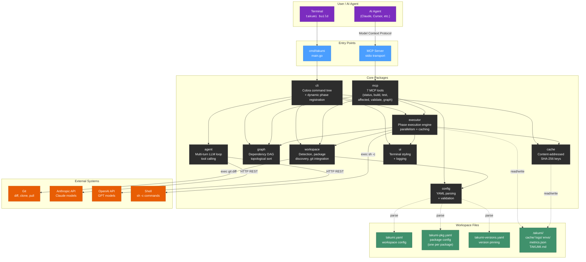
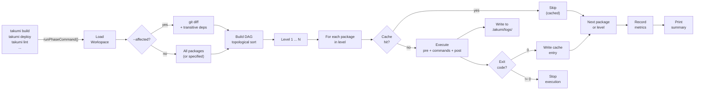
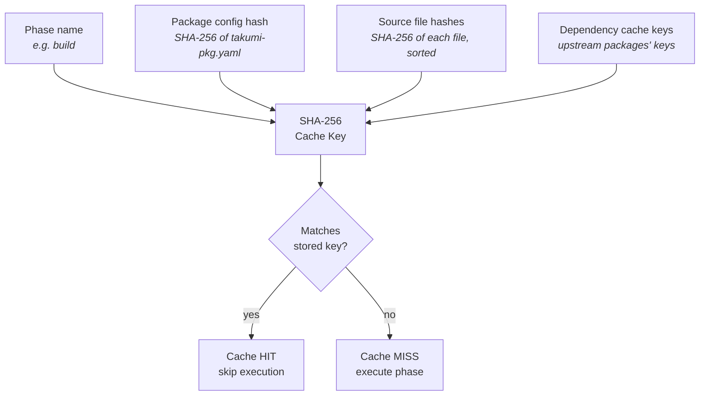
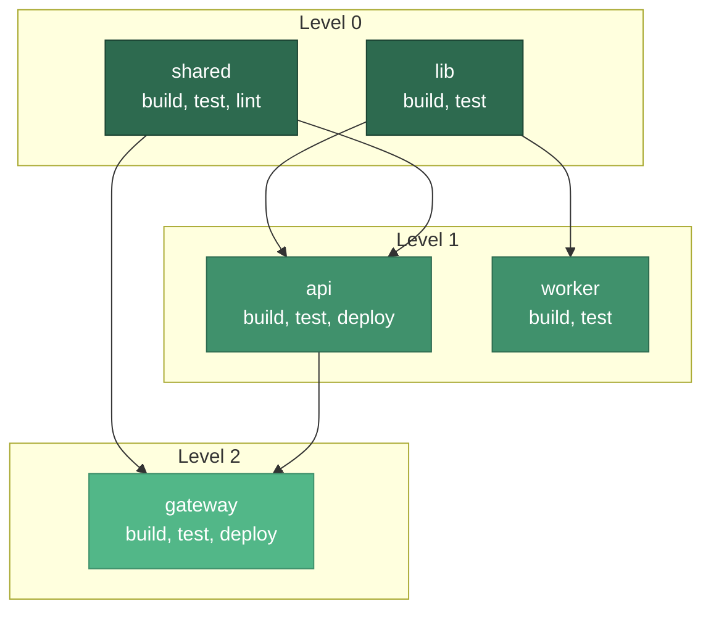
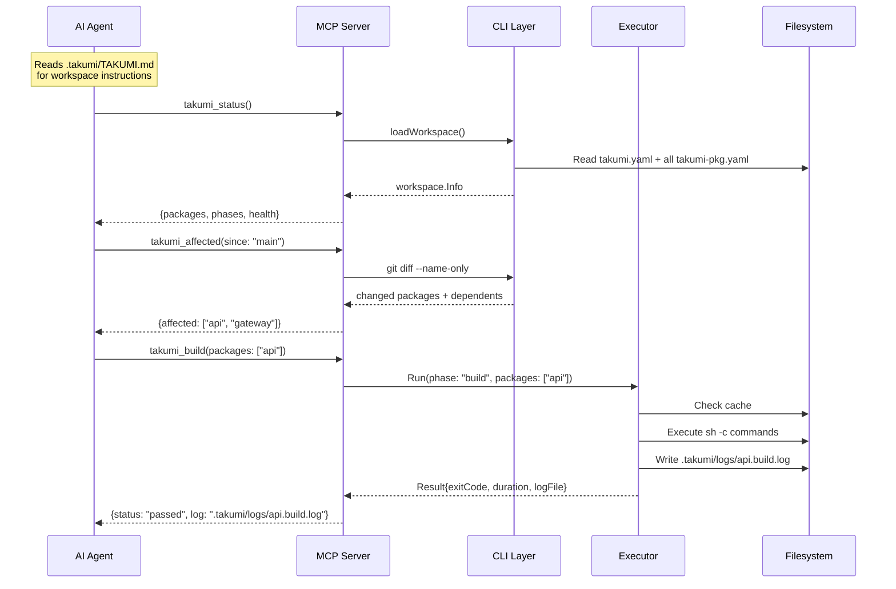

# Architecture Diagram

## System Overview

```mermaid
graph TB
    subgraph User["User / AI Agent"]
        CLI_USER["Terminal<br/><code>takumi build</code>"]
        MCP_CLIENT["AI Agent<br/>(Claude, Cursor, etc.)"]
    end

    subgraph Entry["Entry Points"]
        MAIN["cmd/takumi<br/>main.go"]
        MCP_STDIO["MCP Server<br/>stdio transport"]
    end

    CLI_USER --> MAIN
    MCP_CLIENT -->|"Model Context Protocol"| MCP_STDIO

    MAIN --> CLI
    MCP_STDIO --> MCP

    subgraph Core["Core Packages"]
        direction TB

        CLI["cli<br/>Cobra command tree<br/>+ dynamic phase registration"]
        MCP["mcp<br/>7 MCP tools<br/>(status, build, test,<br/>affected, validate, graph)"]

        WS["workspace<br/>Detection, package<br/>discovery, git integration"]
        CFG["config<br/>YAML parsing<br/>+ validation"]

        EXEC["executor<br/>Phase execution engine<br/>parallelism + caching"]
        GRAPH["graph<br/>Dependency DAG<br/>topological sort"]
        CACHE["cache<br/>Content-addressed<br/>SHA-256 keys"]

        AGENT_PKG["agent<br/>Multi-turn LLM loop<br/>tool calling"]
        UI["ui<br/>Terminal styling<br/>+ logging"]
    end

    CLI --> WS
    CLI --> EXEC
    CLI --> GRAPH
    CLI --> CACHE
    CLI --> AGENT_PKG
    CLI --> UI

    MCP --> WS
    MCP --> EXEC
    MCP --> GRAPH
    MCP --> CFG

    WS --> CFG
    EXEC --> CACHE
    EXEC --> GRAPH
    EXEC --> WS
    EXEC --> UI

    subgraph External["External Systems"]
        GIT["Git<br/>diff, clone, pull"]
        ANTHROPIC["Anthropic API<br/>Claude models"]
        OPENAI["OpenAI API<br/>GPT models"]
        SHELL["Shell<br/>sh -c commands"]
    end

    WS -->|"exec git diff"| GIT
    AGENT_PKG -->|"HTTP REST"| ANTHROPIC
    AGENT_PKG -->|"HTTP REST"| OPENAI
    EXEC -->|"exec sh -c"| SHELL

    subgraph Files["Workspace Files"]
        direction LR
        TYAML["takumi.yaml<br/>workspace config"]
        TPKG["takumi-pkg.yaml<br/>package config<br/>(one per package)"]
        TVER["takumi-versions.yaml<br/>version pinning"]
        TAKUMI_DIR[".takumi/<br/>cache/ logs/ envs/<br/>metrics.json<br/>TAKUMI.md"]
    end

    CFG -.->|"parse"| TYAML
    CFG -.->|"parse"| TPKG
    CFG -.->|"parse"| TVER
    EXEC -.->|"read/write"| TAKUMI_DIR
    CACHE -.->|"read/write"| TAKUMI_DIR

    classDef entry fill:#4a9eff,stroke:#2d7cd6,color:#fff
    classDef core fill:#2d2d2d,stroke:#555,color:#fff
    classDef external fill:#e85d04,stroke:#c44d03,color:#fff
    classDef files fill:#40916c,stroke:#2d6a4f,color:#fff
    classDef user fill:#7b2cbf,stroke:#5a189a,color:#fff

    class MAIN,MCP_STDIO entry
    class CLI,MCP,WS,CFG,EXEC,GRAPH,CACHE,AGENT_PKG,UI core
    class GIT,ANTHROPIC,OPENAI,SHELL external
    class TYAML,TPKG,TVER,TAKUMI_DIR files
    class CLI_USER,MCP_CLIENT user
```

## Execution Pipeline

```mermaid
flowchart LR
    CMD["takumi build<br/>takumi deploy<br/>takumi lint<br/>..."]
    -->|"runPhaseCommand()"| LOAD["Load<br/>Workspace"]
    --> AFFECTED{"--affected?"}

    AFFECTED -->|yes| GITDIFF["git diff<br/>+ transitive deps"]
    AFFECTED -->|no| ALLPKG["All packages<br/>(or specified)"]
    GITDIFF --> RESOLVE
    ALLPKG --> RESOLVE

    RESOLVE["Build DAG<br/>topological sort"]
    --> LEVELS["Level 1 ... N"]

    LEVELS --> FOREACH["For each package<br/>in level"]

    FOREACH --> CACHECHECK{"Cache<br/>hit?"}
    CACHECHECK -->|yes| SKIP["Skip<br/>(cached)"]
    CACHECHECK -->|no| RUN["Execute<br/>pre + commands + post"]

    RUN --> LOG["Write to<br/>.takumi/logs/"]
    RUN --> RESULT{"Exit<br/>code?"}

    RESULT -->|0| WRITECACHE["Write cache<br/>entry"]
    RESULT -->|!= 0| FAIL["Stop<br/>execution"]
    WRITECACHE --> NEXT["Next package<br/>or level"]
    SKIP --> NEXT

    NEXT --> METRICS["Record<br/>metrics"]
    METRICS --> SUMMARY["Print<br/>summary"]
```

## Cache Key Computation

```mermaid
flowchart TB
    PHASE["Phase name<br/><i>e.g. build</i>"]
    CONFIG["Package config hash<br/><i>SHA-256 of takumi-pkg.yaml</i>"]
    FILES["Source file hashes<br/><i>SHA-256 of each file, sorted</i>"]
    DEPS["Dependency cache keys<br/><i>upstream packages' keys</i>"]

    PHASE --> KEY
    CONFIG --> KEY
    FILES --> KEY
    DEPS --> KEY

    KEY["SHA-256<br/>Cache Key"]
    --> LOOKUP{"Matches<br/>stored key?"}

    LOOKUP -->|yes| HIT["Cache HIT<br/>skip execution"]
    LOOKUP -->|no| MISS["Cache MISS<br/>execute phase"]
```

## Package Dependency DAG Example

```mermaid
graph TD
    subgraph Level 0
        LIB["lib<br/>build, test"]
        SHARED["shared<br/>build, test, lint"]
    end

    subgraph Level 1
        API["api<br/>build, test, deploy"]
        WORKER["worker<br/>build, test"]
    end

    subgraph Level 2
        GATEWAY["gateway<br/>build, test, deploy"]
    end

    LIB --> API
    LIB --> WORKER
    SHARED --> API
    SHARED --> GATEWAY
    API --> GATEWAY

    classDef l0 fill:#2d6a4f,stroke:#1b4332,color:#fff
    classDef l1 fill:#40916c,stroke:#2d6a4f,color:#fff
    classDef l2 fill:#52b788,stroke:#40916c,color:#fff

    class LIB,SHARED l0
    class API,WORKER l1
    class GATEWAY l2
```

## AI Agent Integration

```mermaid
sequenceDiagram
    participant Agent as AI Agent
    participant MCP as MCP Server
    participant CLI as CLI Layer
    participant Exec as Executor
    participant FS as Filesystem

    Note over Agent: Reads .takumi/TAKUMI.md<br/>for workspace instructions

    Agent->>MCP: takumi_status()
    MCP->>CLI: loadWorkspace()
    CLI->>FS: Read takumi.yaml + all takumi-pkg.yaml
    CLI-->>MCP: workspace.Info
    MCP-->>Agent: {packages, phases, health}

    Agent->>MCP: takumi_affected(since: "main")
    MCP->>CLI: git diff --name-only
    CLI-->>MCP: changed packages + dependents
    MCP-->>Agent: {affected: ["api", "gateway"]}

    Agent->>MCP: takumi_build(packages: ["api"])
    MCP->>Exec: Run(phase: "build", packages: ["api"])
    Exec->>FS: Check cache
    Exec->>FS: Execute sh -c commands
    Exec->>FS: Write .takumi/logs/api.build.log
    Exec-->>MCP: Result{exitCode, duration, logFile}
    MCP-->>Agent: {status: "passed", log: ".takumi/logs/api.build.log"}
```
